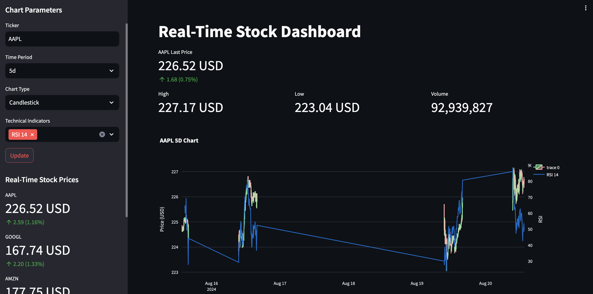

# Real Time Stock Price Dashboard

This project is a real-time stock price dashboard built using Python, Streamlit, Plotly, and various financial data analysis tools. The dashboard allows users to visualize stock prices, apply technical indicators, and monitor real-time prices of selected stocks. The application is powered by the Yahoo Finance API and provides a highly customizable interface for financial analysis.

## Directory Structure

```
Real_Time_Stock_Price_Dashboard/
├── stock_dashboard.py
├── requirements.txt
├── README.md
├── LICENSE
└── Example.png
```

## Features

- **Real-Time Data**: Fetches and displays real-time stock data.
- **Customizable Charts**: Supports candlestick and line charts.
- **Technical Indicators**: Includes Simple Moving Average (SMA) and Exponential Moving Average (EMA).
- **Historical Data**: View and analyze historical stock data.
- **Multiple Tickers**: Monitor multiple stock symbols in real-time.

## Installation

### Prerequisites

Ensure that you have Python 3.8 or higher installed on your machine. You'll also need to install the following Python libraries:

- `streamlit`
- `yfinance`
- `pandas`
- `plotly`
- `ta` (Technical Analysis library)

### Steps to Install

1. **Clone the Repository**

   First, clone the repository to your local machine:
   ```bash
   git clone https://github.com/peterajhgraham/Real_Time_Stock_Price_Dashboard.git
   cd Real_Time_Stock_Price_Dashboard

3. **Install the Required Packages**

   Install the required Python packages using pip:
   ```bash
   pip3 install -r requirements.txt
   ```

   If you don't have a requirements.txt file, you can manually install the dependencies:
   ```bash
   pip3 install streamlit yfinance pandas plotly pytz ta
   ```

3. **Run the Application**

   Once all the dependencies are installed, you can start the Streamlit app:
   ```bash
   python3 -m streamlit run stock_dashboard.py
   ```
   This command will launch the dashboard in your web browser!

   *Example*:

   

## Usage
### Interface Overview

* **Ticker** - Enter the stock ticker symbol you want to analyze (e.g., AAPL for Apple Inc.)

* **Time Period** - Select the time period over which you want to view the stock data (e.g., 1d, 1wk, 1mo, 1y, etc.)

* **Chart Type** - Choose between a candlestick chart and a line chart

* **Technical Indicators** - Select one or more technical indicators to apply to the chart

### Real-Time Stock Prices

The sidebar displays the real-time prices for a predefined list of stock symbols (e.g., AAPL, GOOGL, AMZN, MSFT). These prices update automatically and show the percentage change from the opening price.

### Customization

You can easily modify the list of stock symbols monitored in real-time by editing the stock_symbols list in the app.py file.

### Example Usage

1. Monitoring Apple Stock in Real-Time:

    * Enter `AAPL` in the ticker input

    * Select `1d` for the time period

    * Choose the Candlestick chart type

    * Select `SMA 20`, `EMA 20`, & `RSI 14` for technical indicators

    * Click `Update` to visualize the data

2. Viewing Historical Data:

    * Select a longer time period (e.g., `1y`)

    * Use the `Line` chart type for a smooth trend visualization.

    * Analyze the historical data displayed below the chart.

## Known Issues

  * **Data Fetching Errors**: If no data is returned for a given ticker, an error message will be displayed. Ensure that the ticker symbol is correct and try again.

## Contributing

Contributions are welcome! If you have ideas for new features, elements, or enhancements, feel free to fork the repository and submit a pull request. Please ensure your code follows geenral best practices and is well-documented.

## License

This project is licensed under the MIT License. See the LICENSE file for more details.

## Contact
For questions or support, please contact me at peter_graham@brown.edu.
